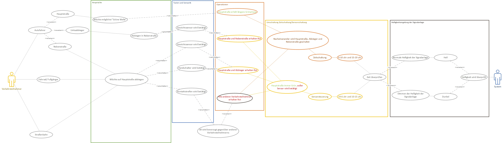
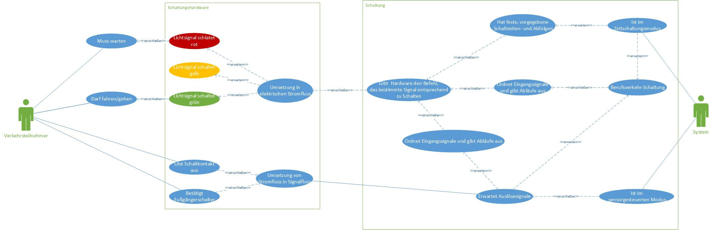
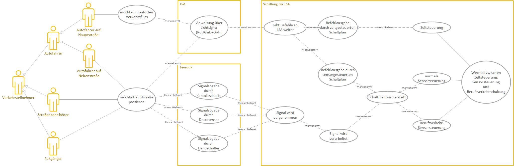
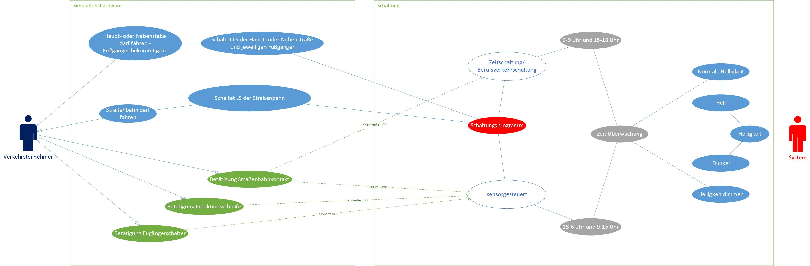

# Lastenheft: Projekt LSA
## 1. Zielbestimmung
**1.1.**  
Für eine fiktive Kreuzung, soll eine Lichtsignalanlage geplant, entwickelt und gebaut werden. Das Programm für die Lichtsignalanlage soll nach bestehenden Standards aufgebaut und eingerichtet werden. Die Lichtsignalanlage, soll vor dem eigentlichen Baubeginn, hardwaretechnisch simulierbar sein, um Fehlplanung zu vermeiden und Folgekosten niedrig zu halten.

## 2. Gebrauch/Zielbestimmung
**2.1.   
A01** 
Der Verkehr einer 4-Wege-Kreuzung, von denen eine Straße als Hauptstraße mit mehr Verkehrsaufkommen gegenüber der anderen Straße (Nebenstraße) angesehen werden kann, soll durch eine Schaltung gesteuert werden. (Yannik Schäkel)

**2.2.   
A02** 
Die für Autofahrer bestimmten Ampeln sollen jeweils aus einem roten, gelben und grünen Lichtsignal bestehen. (Janis Kinzinger)

**2.3.  
A03**  
Die Schaltung soll die Anwesenheit von Verkehrsteilnehmern auf Nebenstraße und Abbiegerspur berücksichtigen können. (Hendric Schüttenberg)

**2.4.  
A04**  
Eine Dritte Ampel soll Abbiegern auf der Hauptstraße das Abbiegen ermöglichen. (Hendric Schüttenberg)

**2.5.  
A05**  
Eine Umstellung von einer festen Zeitschaltung auf eine sensorgesteuerte Schaltung soll möglich sein. (Janis Kinzinger)

**2.6.  
A06**  
Die Schaltung soll eine Straßenbahn, die die Kreuzung quert, mit höherer Priorität gegenüber den anderen Verkehrsteilnehmern behandeln. (Michel Brandes)

**2.7.  
A07**  
Die Straßenbahnschaltung soll durch einen Entfernungsmesser automatisch aktiviert werden. (Michel Brandes)

**2.8.  
A08**  
Die Helligkeit der Lichtsignalanlage (LSA) soll ohne das Eingreifen eines Menschen immer an aktuelle Lichtverhältnisse angepasst sein, sodass eine ausnahmslos gute Sichtbarkeit gewährleistet ist. (Yannik Schäkel)

## 3. Sicherheit
**3.1.**  
Das Programm muss nach geltenden Normen und Coderichtlinien aufgebaut und programmiert werden.

**3.2.**  
Die Hardware muss Sicherheitstechnischen Standards und Normen entsprechen

## 4. Kontrolle
**4.1.**  
Das Projekt soll in mehrere Zyklen unterteilt werden, um zwischendurch Probleme oder Fehler erkennen zu können.

**4.2.**  
Für die Kontrolle ist einzig allein der Auftraggeber verantwortlich.

**4.3.**  
Wöchentlich soll der Projektverlauf dokumentiert und gemeldet werden.
## 5. Montage
**5.1.**  
Die Montage des Produktes soll durch Fachkräfte erfolgen.

**5.2.**  
Die Inbetriebnahme, soll erst nach Prüfung und Bewertung der hardwaretechnisch simulierten Lichtsignalanlage erfolgen.

## 6. Instandhaltung
**6.1.**  
Die Instandhaltung der Lichtsignalanlage wird vom öffentlichen Bauträger (Bauhof der Stadt Braunschweig) bewältigt.

**6.2.**  
Programm und Steuerungstechnisch verpflichtet sich der Auftragnehmer die Anlage 10 Jahre lang zu warten und Instand zu halten.

## 7. Kosten
**7.1.**  
Um die Kosten gering zu halten, sollen vorhandene Programme und Materialien verwendet werden.

## 8. Termine  
**8.1.**  
20.04.2017 Start des Projekts   
**8.2.**  
02.05.2017 Planungsphase abschließen    
**8.3.**  
28.06.2017 Feingestaltung des Codes und der Hardware  
**8.4.**  
17.07.2017 Fertigstellung und fristgerechte Übergabe des Projekts an den Kunden    

## 9. Use-Case Diagramme  
Zur Projektidee unserer Gruppe wurden verschiedene Use-Case-Diagramme erstellt, die den möglichen, schematischen Aufbau der LSA-Schaltung verdeutlichen sollen:

Use-Case-Diagramm von Hendric:

Use-Case-Diagramm von Janis:

Use-Case Diagramm von Michel:

Use-Case Diagramm von Yannik:
