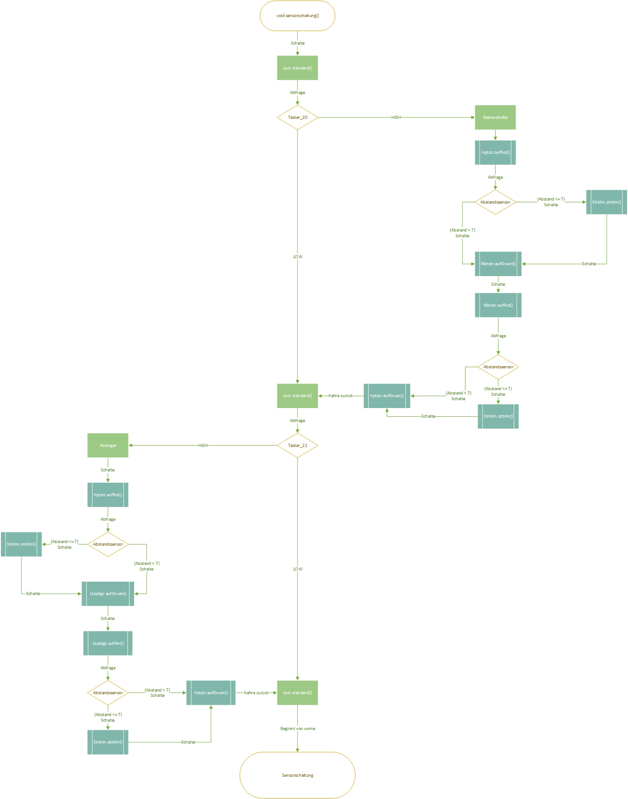

# Pflichtenheft: Projekt LSA

## 1. Zielbestimmung

**1.1. Musskriterien**  
**1.1.1**  
**P01:**  
Der Verkehr einer [4-Wege-] Kreuzung zweier mehrspuriger Straßen und einer nach rechts abbiegenden Straßenbahn Linie soll durch eine Schaltung gesteuert werden. Die Schaltung soll durch einen Fundoino Mega realisiert werden, dieser wird mit diversen Sensoren und Schaltern verbunden um die geforderten Funktionen zu erfüllen. Das programmieren der Schaltungen soll durch Arduino Create erfolgen.  

**1.1.2.**  
**P02:**  
Die für Autofahrer bestimmten Ampeln sollen jeweils aus einem roten, gelben und grünen Lichtsignal bestehen. Zwei Ampeln sollen visuell Fahranweisungen an die Verkehrsteilnehmer auf Haupt- und Nebenstraße geben. Sie werden durch LEDs in den Farben rot, grün und gelb dargestellt. Die Steuerung erfolgt durch den in P01 genannten Funduino Mega.  

**1.1.3.**  
**P03:**  
Die Schaltung soll die Anwesenheit von Verkehrsteilnehmern berücksichtigen können. Durch Druckschalter soll die Anwesenheit von Fußgängern, Autofahrern auf der Nebenstraße und der Straßenbahn simuliert werden.

How to:  
Die Anwesenheit der Verkehrsteilnehmer muss lediglich in der Sensorschaltung(Nachtschaltung) berücksichtigt werden. Hierfür wird eine if- Schleife programmiert, für jede Straße und ebenfalls für die Straßenbahn. Aufgrund der geringen Anzahl an Analog ansteuerbaren Pins des Arduino Megas, wird die Nebenstraße mit den Fußgängern zusammen geschaltet, gleiches gilt für die Hauptstraße. Nachdem die Taster eingepflegt sind, wird noch eine Funktion geschrieben, sodass das Programm(Schaltung) wieder auf ihren Ausgangszustand zurückkehrt.  

**1.1.4.**   
**P04:**  
Eine dritte Ampel soll den Verkehrsteilnehmern auf der Abbiegespur, das abbiegen in die Nebenstraße ermöglichen

How to:  
Es wird eine weitere Ampel in den Code implementiert mit den Signalen Rot/Gelb/Grün. Ein Taster wird als Simulation für einen Gewichtssensor eingefügt.
 
**1.1.5.**  
**P05:**  
Eine Umstellung von einer festen Zeitschaltung auf eine sensorgesteuerte Schaltung soll möglich sein. Durch die Betätigung eines weiteren Schalters, welcher eine Uhrzeit bedingte Simulation darstellt, soll der Schaltplan von Zeitschaltung auf sensorgesteuert wechseln.    
  
  
  
**1.1.6.**    
**P06:**  
Die Schaltung soll eine Straßenbahn, die die Kreuzung quert, mit höherer Priorität gegenüber den anderen Verkehrsteilnehmern behandeln. Dies wird durch wiederholte Abfrage des für die Straßenbahn genutzen Sensors erreicht, die Abfrage soll vor und nach der Schaltung von Neben- oder Abbiegerampel erfolgen, damit die Aktivierung der Straßenbahn nicht einene weitere Schaltung der Hauptampel abwarten muss.   

**1.1.7.**  
**P07:**  
Die Straßenbahnschaltung soll durch einen Entfernungsmesser automatisch aktiviert werden.    

How to:  
Als Entfernungsmesser soll ein Ultraschallsensor genutzt werden, der mit dem Arduino verbunden ist. Der Sensor soll die Zeit messen, die ein Ultraschallsignal braucht um vom Sensor ausgegeben zu werden, an einem Objekt abzuprallen und wieder vom Sensor aufgenommen zu werden. Aus dieser Zeit kann dann die Entfernung des Objektes zum Sensor berechnet werden, wenn diese Entfernung 7cm unterschreitet soll die Straßenbahnschaltung aktiviert werden.     

**1.1.8.**  
**P08:**  
Die Helligkeit der Lichtsignalanlage (LSA) soll ohne das Eingreifen eines Menschen immer an aktuelle Lichtverhältnisse angepasst sein. Durch den Einbau einenes Fotowiderstandes in die Schaltung soll sich die Helligkeit der Ampeln aus P02 automatisch an die Lichtverhältnisse der Umgebung anpassen.  

  
**1.2. Wunschkriterien**  
Code offen für nachträgliche Implementierung von zusätzlichen Funktionen.

**1.3. Abgrenzungskriterien**  
Die Software soll ausschließlich für eine, am Anfang ausgedachte fiktive Kreuzung, kompatibel sein.    

## 2. Produkteinsatz
Das Produkt soll die öffentliche Infrastruktur unterstützen und Abläufe im Verkehr steuern und verbessern. Es soll automatisch laufen und Tag und Nacht arbeiten.   

## 3. Produktfunktionen
**3.1.**  
**Funktionsname:**  
Lichtsignalanlage  

**3.2.**  
**Nachbedingung Erfolg:**  
Programm soll weiterhin im Loop laufen  

**3.3.**  
**Nachbedingung Fehlschlag:**  
Programm soll die Loop von vorne beginnen  

**3.4.**  
**Akteure:**  
Steuerung und Programm wird nur von „Die Programmierer“ bearbeitet und verwaltet 

**3.5.**  
**Auslösendes Ereignis:**  
Die Anlage wird gestartet und läuft automatisiert weiter  

**3.6.**  
**Beschreibung:**  
Der Code und die Hardware stellen eine fiktive Kreuzung da. Über LEDs, Taster und Sensoren kann das Programm mit unterschiedlichen Bedingungen gespeist werden.  

**3.7.**  
**Erweiterung:**  
Der Code wird so erstellt, dass später weitere Funktionen Implementiert werden können.    

## 4. Produktleistungen  
Das Produkt soll eine hohe Ausfallsicherheit haben. Bei Bedarf kann die Schaltung mit einer USV ausgestattet werden, um dem Abstürzen des Programms bei Spannungsausfall entgegen zu wirken und ein Automatisches weiterlaufen bei Spannungsrückkehr ohne Techniker zu ermöglichen. Falls gewünscht und erforderlich kann die Systemhardware redundant ausgelegt werden.  

## 5. Qualitätsanforderungen  

**5.1. Funktionalität:**  
Hardware wie auch Software werden nach Sicherheit ausgewählt und geschrieben.  

**5.2. Zuverlässigkeit:**  
Im Verkehr würden Fehler zu Unfällen führen, was unbedingt vermieden werden muss. Daher wird die Schaltung und die Software vorher ausgiebig getestet.  

**5.3. Effizienz:**  
Durch Verwendung von LEDs und eines Micro Controllers, wird der Energieverbrauch so gering wie möglich gehalten. Jedoch steht die Sicherheit vor der Effizienz.  

## 6 Benutzeroberfläche  
Eine Benutzeroberfläche ist nicht notwendig, da das Produkt nur von Fachkundigem Personal gewartet und bedient wird. Die Lichtsignalanlage wird nach Nationalem Standard aufgebaut und Beschildert.  
