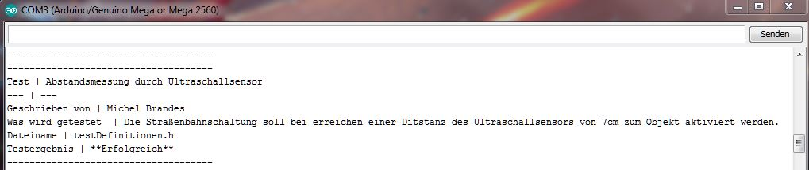
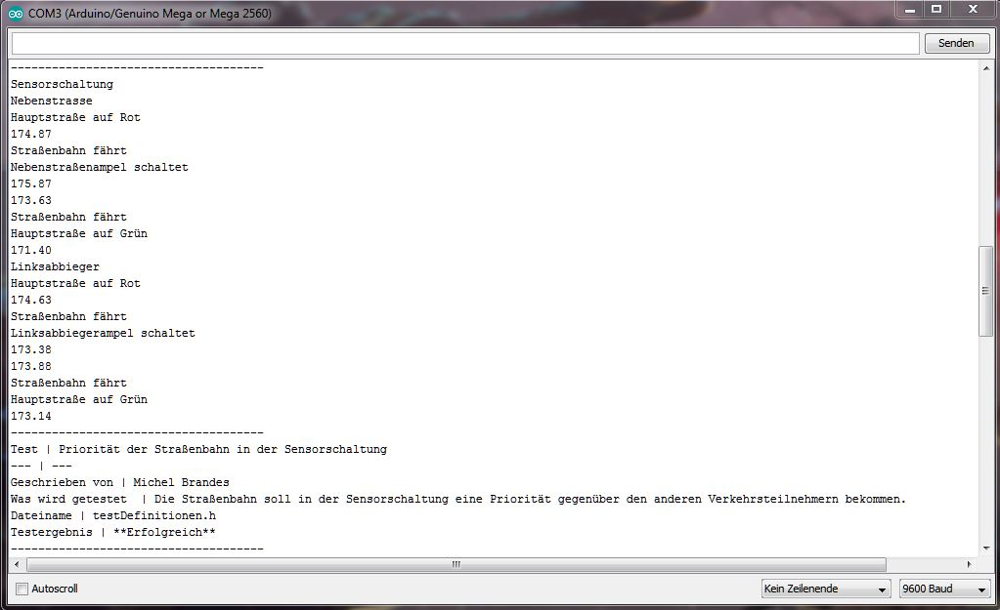
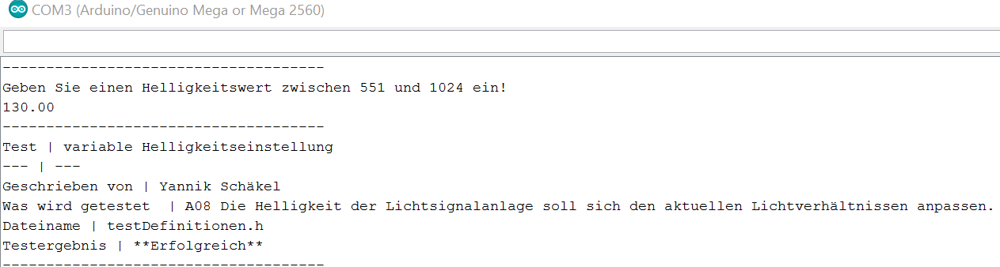
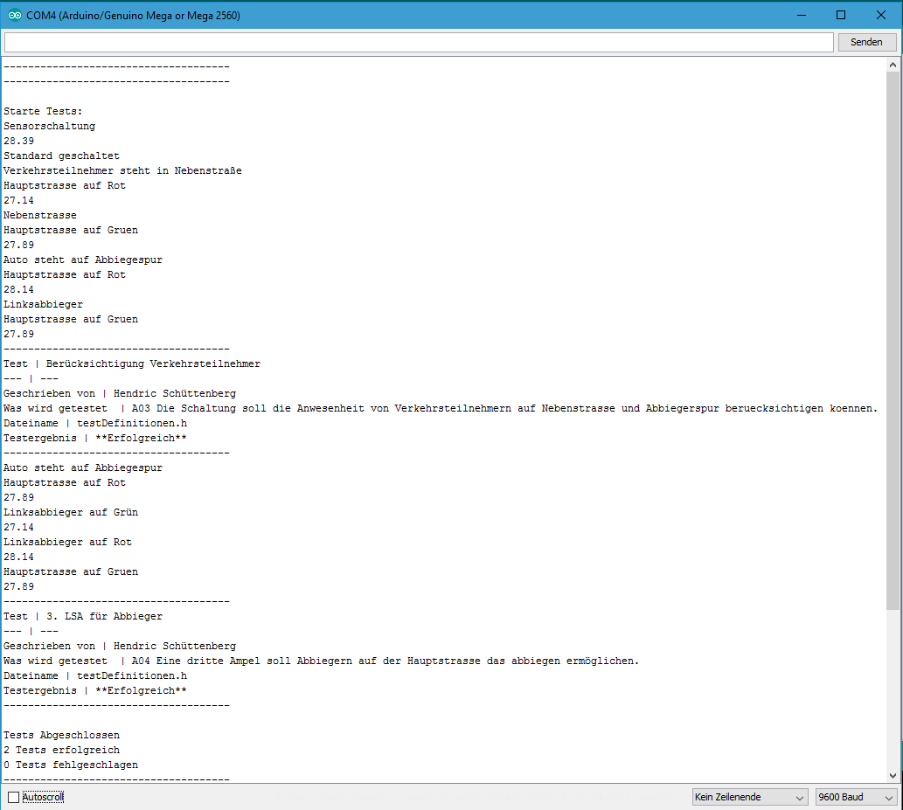
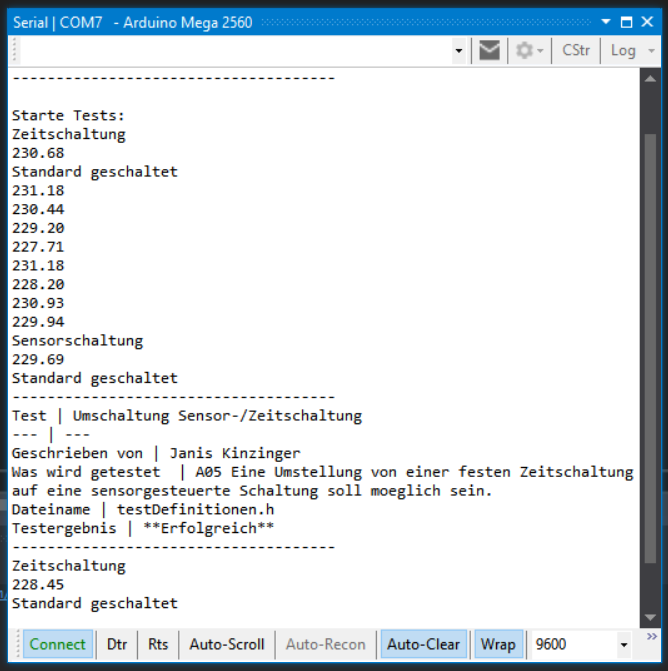
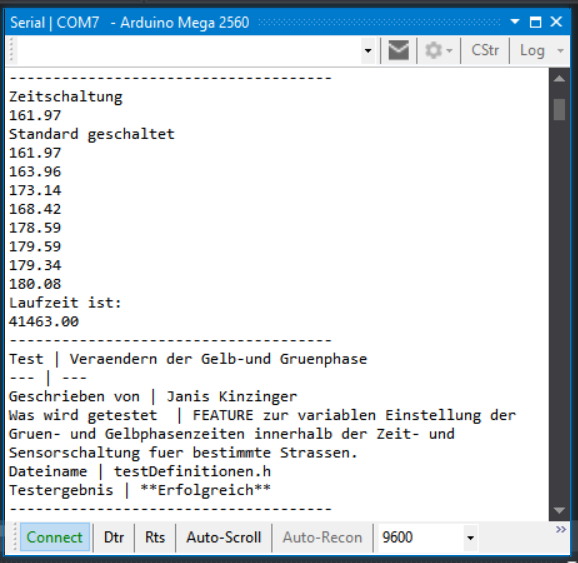

## Testing Michel:

-------------------------------------
Test | Abstandsmessung durch Ultraschallsensor
--- | ---
Geschrieben von | Michel Brandes
Was wird getestet  | A07 Die Straßenbahnschaltung soll durch einen Entfernungsmesser automatisch aktiviert werden. 
Dateiname | testDefinitionen.h
Testergebnis | **Erfolgreich**
-------------------------------------

   

Test | Priorität der Straßenbahn in der Sensorschaltung
--- | ---
Geschrieben von | Michel Brandes
Was wird getestet  | A06 Die Schaltung soll eine Straßenbahn, die die Kreuzung quert, mit höherer Priorität gegenüber den anderen Verkehrsteilnehmern behandeln.
Dateiname | testDefinitionen.h
Testergebnis | **Erfolgreich**
-------------------------------------

Tests Abgeschlossen  
2 Tests erfolgreich  
0 Tests fehlgeschlagen

## Testing Yannik:
-------------------------------------
Test | Variable Helligkeitssteuerung
--- | ---
Geschrieben von | Yannik Schäkel
Was wird getestet  | A08 Die Helligkeit der Lichtsignalanlage soll sich den aktuellen Lichtverhältnissen anpassen. 
Dateiname | testDefinitionen.h
Testergebnis | **Erfolgreich**
-------------------------------------
  

Test Abgeschlossen
1 Test Erfolgreich
0 Test Fehlgeschlagen

## Testing Hendric:

-------------------------------------
Test |Berücksichtigung Verkehrsteilnehmer
--- | ---
Geschrieben von | Hendric Schüttenberg
Was wird getestet  | A03 Die Schaltung soll die Anwesenheit von Verkehrsteilnehmern auf der Nebenstrasse und Abbiegespur berücksichtigen können.
Dateiname | testDefinitionen.h
Testergebnis | **Erfolgreich**
-------------------------------------

Tests Abgeschlossen  
1 Tests erfolgreich  
0 Tests fehlgeschlagen

-------------------------------------
Test |3. LSA für Abbieger
--- | ---
Geschrieben von | Hendric Schüttenberg
Was wird getestet  | A04 Eine dritte Ampel soll Abbiegern auf der Hauptstrasse das abbiegen ermöglichen.
Dateiname | testDefinitionen.h
Testergebnis | **Erfolgreich**
-------------------------------------

Tests Abgeschlossen  
1 Tests erfolgreich  
0 Tests fehlgeschlagen

### Testing Janis:  

-------------------------------------
Test | Umschaltung Sensor-/Zeitschaltung
--- | ---
Geschrieben von | Janis Kinzinger
Was wird getestet  | A05 Eine Umstellung von einer festen Zeitschaltung auf eine sensorgesteuerte Schaltung soll moeglich sein.
Dateiname | testDefinitionen.h
Testergebnis | **Erfolgreich**
-------------------------------------

   

Test | Veraendern der Gelb-und Gruenphase
--- | ---
Geschrieben von | Janis Kinzinger
Was wird getestet  | FEATURE zur variablen Einstellung der Gruen- und Gelbphasenzeiten innerhalb der Zeit- und Sensorschaltung fuer bestimmte Strassen.
Dateiname | testDefinitionen.h
Testergebnis | **Erfolgreich**
-------------------------------------

Tests Abgeschlossen  
2 Tests erfolgreich  
0 Tests fehlgeschlagen

