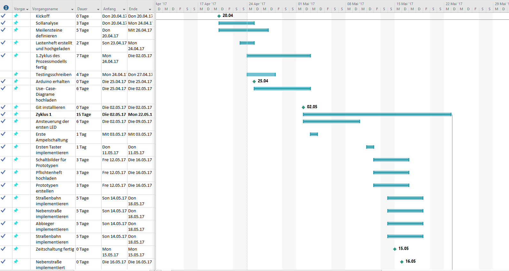
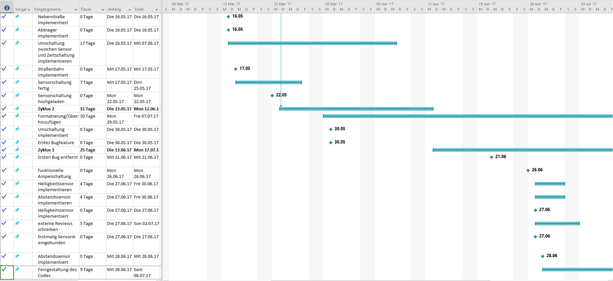
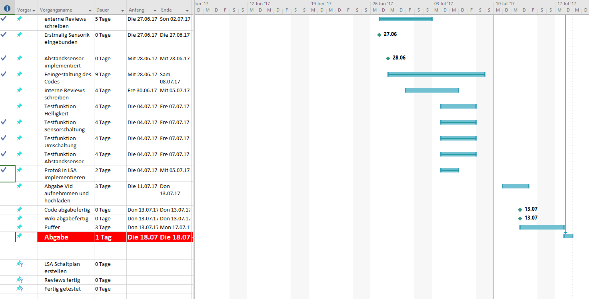

Unser Zeitplan: 

Der Projektfortschritt wurde im wöchentlichen Turnus im Reiter `Projektverlauf` dokumentiert. Hierzu wurde jeden Dienstag von 13:15- 14:45 ein Teamtreffen abgehalten

**Meilensteine:**

**M01** Arduino erhalten (Janis Kinzinger) ***Erreicht am 25.04.2017***
- Der Arduino wurde von Yannik ausgeliehen beim iFF

**M02** Grobes Code-Management (Arbeitsverteilung innerhalb der Gruppe festlegen) ***Nicht Erreicht***
- Durch Aufteilung der verschiedenen Sensoren auf alle vier Personen, musste ein grobes Codemanagement nicht vollzogen werden. 

**M03** LSA Schaltplan erstellen (Bestehend aus: Zeichung der zu steuernden Kreuzung, Festlegen der Zeiten und Schaltungsmodi der verschiedenen Ampeln) (Yannik Schäkel) ***Erreicht am 10.07.2017***

**M04** Erstmalig Sensorik in Programmcode des Arduinos eingebunden (Taster, Lichtschranken etc.) (Michel Brandes) ***Erreicht am 27.06.2017***

**M05** Erstmalig funktionelle, sinnvolle Ampelschaltung programmiert (Hendric Schüttenberg) ***Erreicht am 26.06.2017***
- Die Lichtsignalanlage ist fertig programmiert und ist nachvollziehbar.

**M06** Sensorgesteuerte Helligkeit der LEDs in Ampelschaltung implementiert (Yannik Schäkel) ***Erreicht am 27.06.2017***
- Die Schaltung reagiert nun auf die Helligkeit und dimmt entsprechend die Signalanlage.

**M07** Entscheidung über finale Komplexität der Schaltung (Hendric Schüttenberg) ***Erreicht am 28.06.2017***
- Die Lichtsignalanlage wird aus Zeit- und Sensorschaltung bestehen, zwischen denen mittels eines Schalters gewählt werden kann. Die Sensorschaltung verfügt über zwei Schalter zur Simulierung der Drucksensoren und einem Abstandssensor für die Straßenbahn. Beide Schaltung verfügen über eine Regelung der Helligkeit über einen Fotowiderstand.

**M08** Tramverkehr in Ampelschaltung sinnvoll integriert (Michel Brandes) ***Erreicht am 17.05.2017***
- Ob die Tram (Straßenbahn) wartet, wird nach jedem Schaltungsschritt abgefragt

**M09** Abschließende Prüfung auf mögliche Funktionsdefizite und Fehler ***Erreicht am***

**M10** Sensorschaltung fertig  (Hendric Schüttenberg) ***Erreicht am 22.05.2017***
- Die Sensorschaltung berücksichtigt alle Verkehrsteilnehmer

**M11** Zeitschaltung fertig (Hendric Schüttenberg) ***Erreicht am 15.05.2017***
- Die Zeitschaltung läuft eine programmierte Reihenfolge von Schaltungsschritten ab, sie kann lediglich durch eine wartende Straßenbahn unterbrochen werden.

**M12** Erfolgreiche Implementierung beider Schaltungen (Janis Kinzinger) ***Erreicht am 30.05.2017***

**M13** Programm für Arduino fertig geschrieben ***Erreicht am 12.07.2017***

**M14** Reviews fertig (Yannik Schäkel) ***Erreicht am 12.07.2017***

**M15** Testfunktionen implementiert und fertig gestestet (Michel Brandes) ***Erreicht am 12.07.2017***

**M16** Erstes Bugfeature und Bug entfernt (Janis Kinzinger)***Erreicht am 21.06.2017***
- Ein erster Bug wurde duch Janis gefunden und in Teamleistung behoben.

